# W5 Evidence Pack — AWS Network Fortress

**XBrain AWS Accelerator · Tuần 5 · Evidence Submission**

---

## Cover

| Field | Value |
|-------|-------|
| **Group ID** | GROUP 07 |
| **Team Members** | 1. Bùi Thành Nghĩa 2. Hoàng Kim Hùng 3. Trần Minh Quang 4. Nguyễn Công Thịnh 5. Phạm Công Huy 6. Lê Thị Thuỳ Trang 7. Lê Nguyễn Nhật Thành 8. Đỗ Phúc 9. Nguyễn Tất Văn |
| **Repository Link** | Backend: https://github.com/lennhatthanh/Project_G7_BE   Frontend: https://github.com/lennhatthanh/Project_G7_FE|
| Prior evidence | W4 evidence pack link: https://github.com/BuiThanhNghiaDTU19122004/Group7/blob/main/Week_4/W4_Group7_Evidence_Pack.md |
| Live frontend | CloudFront frontend URL: `[paste here]` |
| Live backend | ALB or backend CloudFront health URL: `[paste here]` |

---

## Architecture Diagram

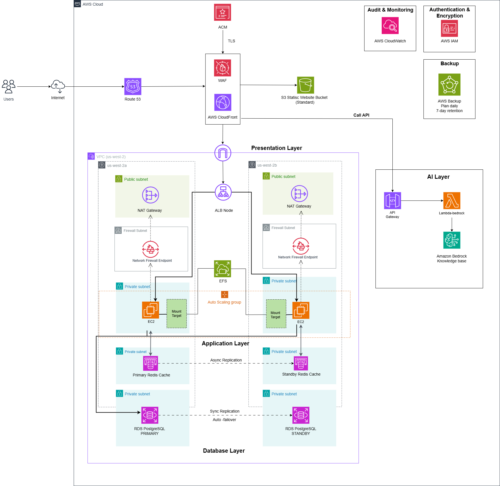
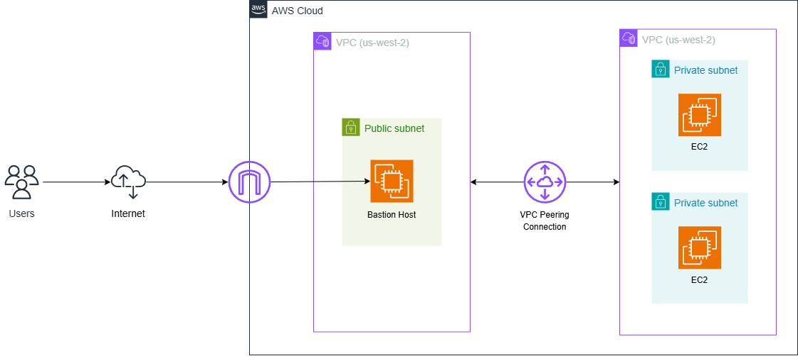
---

# MH1 — Multi-VPC Connectivity

## Chosen Path And Rationale

**Architecture:** VPC Peering (Path A)
SanGo uses two VPCs with non-overlapping CIDR blocks:

| VPC | CIDR | Purpose |
|---|---:|---|
| `hung-service-app-vpc` | `10.0.0.0/16` | Main 3-tier application stack: ALB, EC2 ASG, EFS, RDS, Redis, Lambda |
| `hung-service-mgmt-vpc` | `10.1.0.0/16` | Management plane: Bastion host for private access |

VPC Peering is the right choice because the project has exactly two VPCs, needs direct private connectivity from Bastion to the app tier, and does not need transitive routing or hub-and-spoke connectivity. Transit Gateway would add cost and complexity without a current routing need.

---

## Evidence

### Screenshot 1: VPC Peering Status

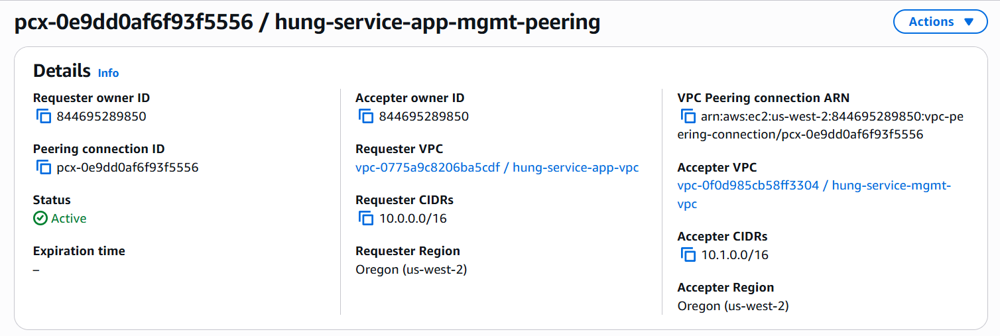

---

### Screenshot 2: Route Table — AZ A

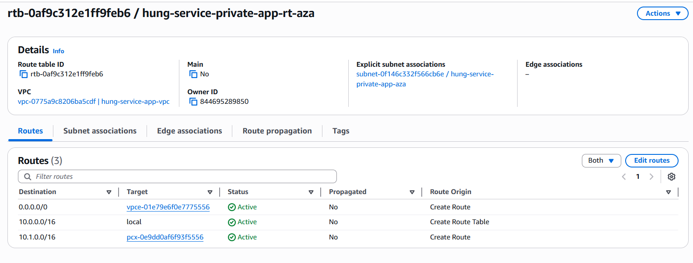

---

### Screenshot 3: Route Table — AZ B

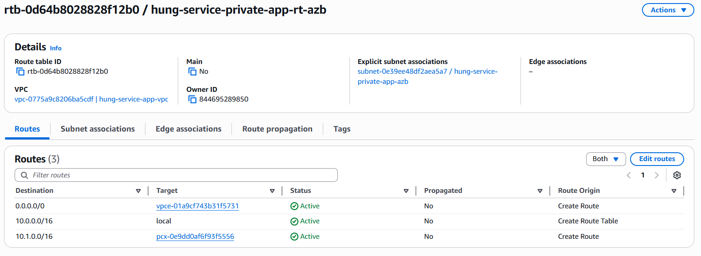

---

### Screenshot 4: VPC Flow Logs — ACCEPT Entries

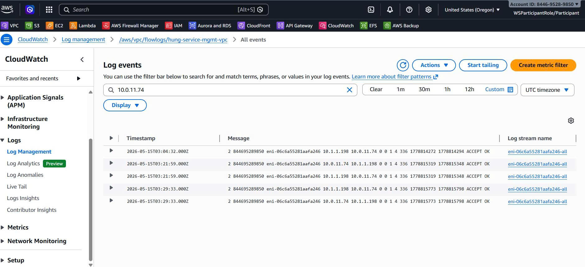

**Sample (from CloudWatch):**

**Ping test result:**
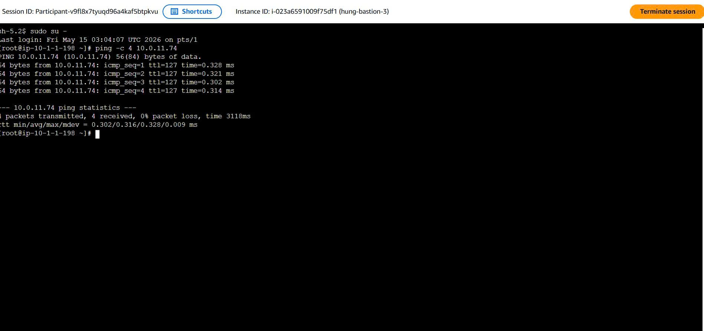

---

# MH2 — Network Firewall / Hardened SG+NACL

## Lựa Chọn & Rationale

**Architecture:** AWS Network Firewall + Stateful Domain-Based Rules

**Rationale:**
SanGo must use Network Firewall because private app EC2 instances have outbound internet access through NAT Gateway. The W5 guide says SG+NACL-only hardening is not valid when EC2 or Lambda reaches the internet through NAT.
- Defense-in-depth: Firewall → Private Subnet → Security Group
- Centralized logging (CloudWatch Logs)
---

## Evidence

### Screenshot 1: Firewall Configuration

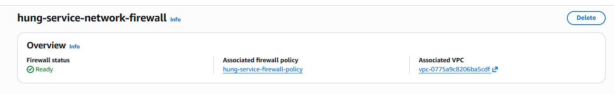
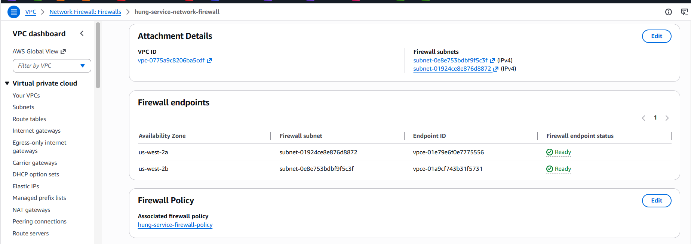

---

### Screenshot 2: Rule Group — Domain Allowlist

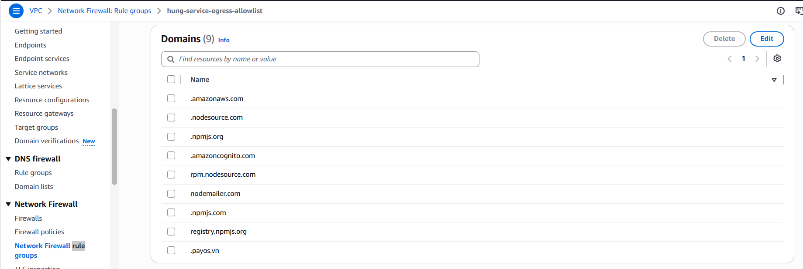

**Allowed Domains:**

---

### Screenshot 3: Route Table — Private Subnet

---

### Screenshot 4: Route Table — Firewall Subnet

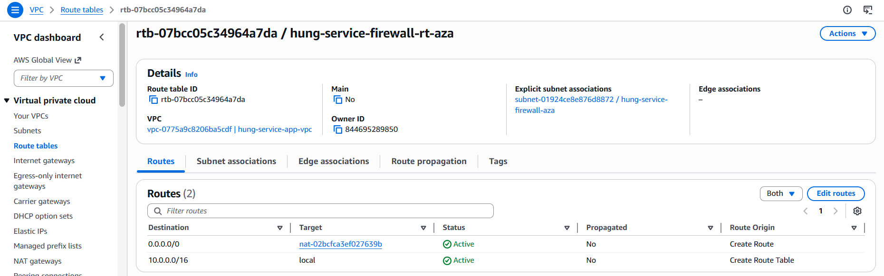
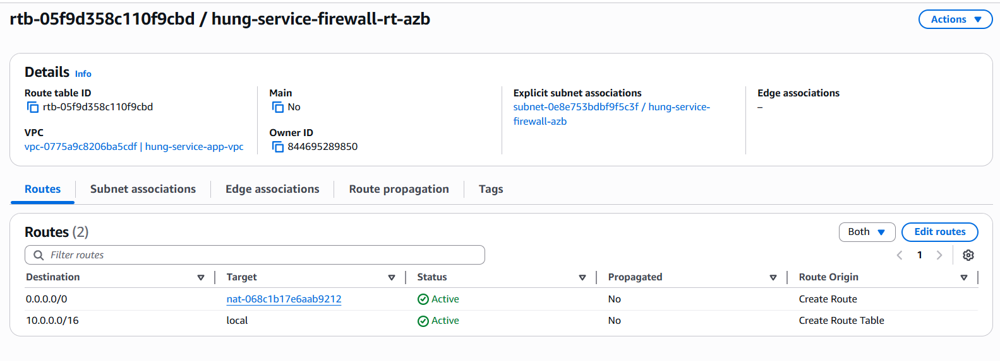

---

### Screenshot 5: Test — Allowed Request (HTTP 200) ✅

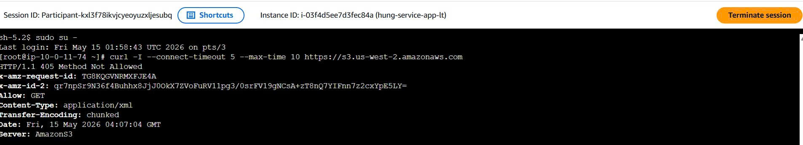

---

### Screenshot 6: Test — Blocked Request (Negative Test) ❌

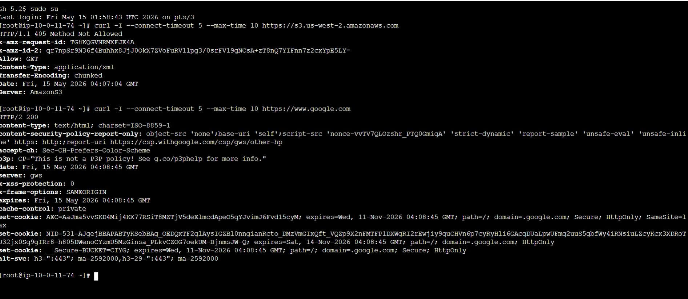

---

### Screenshot 7: CloudWatch Alert Logs

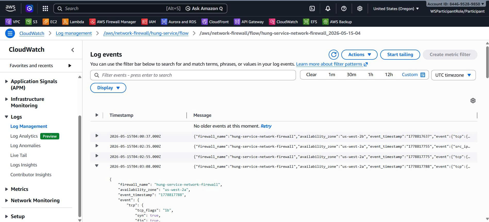
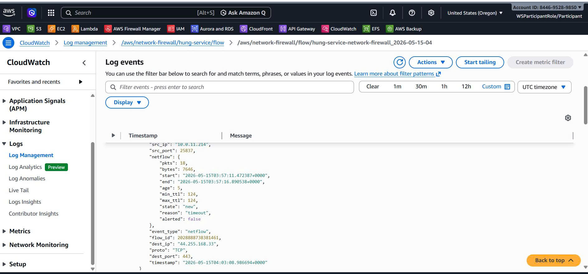

**Alert entry (blocked domain):**

**Result:** 

**CloudWatch Evidence:** 

---

# MH3 — File Storage + Backup Plan

## Lựa Chọn & Rationale

**Architecture:** Amazon EFS + AWS Backup

**Rationale:**
SanGo app tier runs on Amazon Linux EC2 instances in private app subnets, so EFS is appropriate for shared POSIX/NFS storage. It supports multi-AZ mount targets and lets app instances share uploaded venue files or fallback shared content under `/mnt/efs/uploads`.

---

## Evidence

### Screenshot 1: EFS Mount — Private Subnet
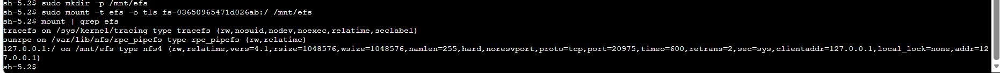

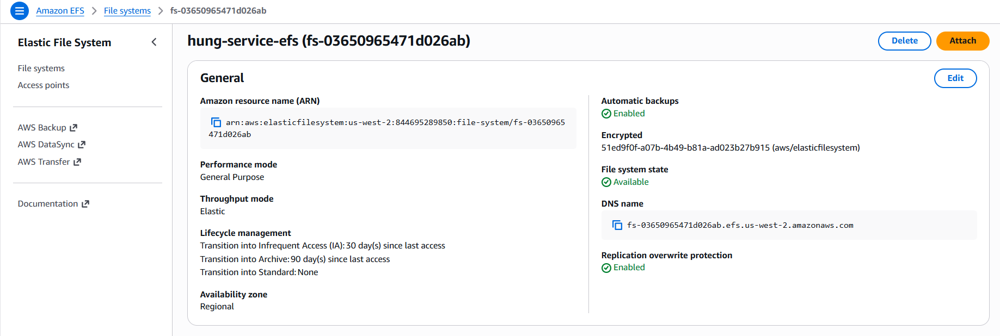

**EFS File System And Mount Targets**

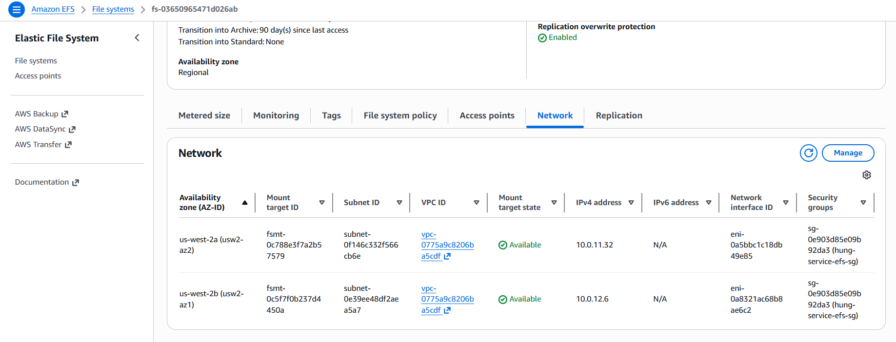

---

### Screenshot 2: EFS Read/Write Test

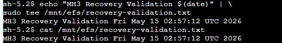

---

### Screenshot 3: Backup Plan Configuration

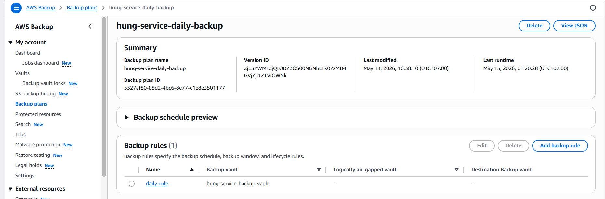

**Info (1-2 lines):**

---

### Screenshot 4: Backup Job — COMPLETED

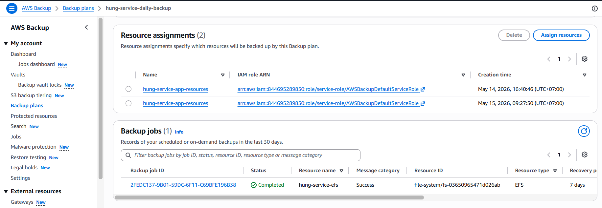

**Info:**

---

### Screenshot 5: Restore Job — COMPLETED

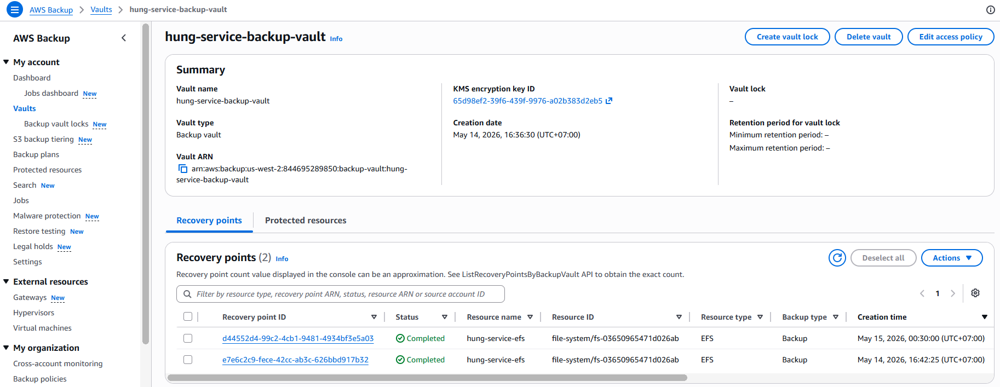

**Info:**

---

### Screenshot 6:   ✅

**Mounted restored EFS at /mnt/restored-efs:**

---

# MH4 — API Gateway

## Lựa Chọn & Rationale

**Architecture:** REST API + Lambda Authorizer (or API Key)

This is the easiest meaningful endpoint because it maps directly to the existing serverless layer in Terraform:

- API Gateway HTTP API: `chatbox-usage-plan`
- Route: `POST /chatbox`
- Integration: Lambda proxy -> `project-g7-get-san-choi`
- Authentication: Lambda authorizer -> `chatbox-api-keyr`
- Header checked: `x-api-key`
- Throttling: HTTP API stage default route settings, rate `100`, burst `200`

---

## Evidence

### Screenshot 1: API Gateway Route

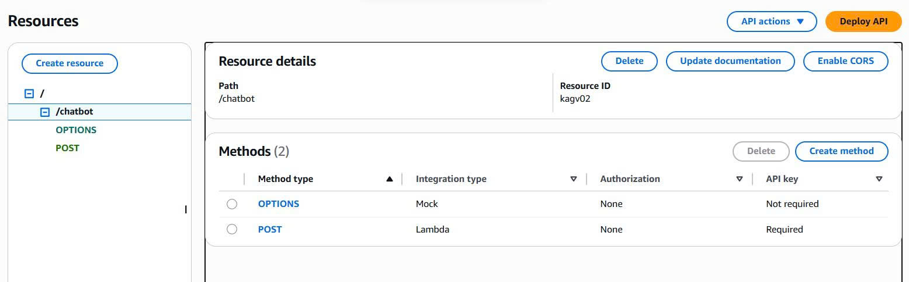

---

### Screenshot 2: API KEY

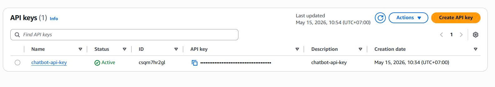

---
### Screenshot 3: Stage Throttling

**Method Details (1 line):**

---
### Screenshot 3: Test 200 — Authorized Request ✅

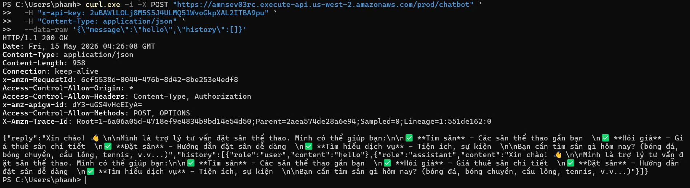

---

### Screenshot 4: Test 403 — Unauthorized Request ❌

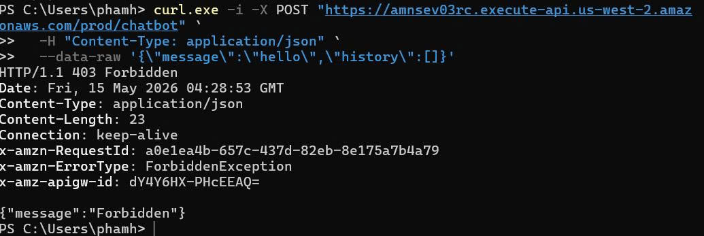

---
# Negative Security Tests

---

## Test 1 — SQL Injection Prevention

**Attack Vector:** Input: `{"username":"admin\" OR \"1\"=\"1\""}`

**Mitigation:** 

**Screenshot:**

**Result:** 

---

## Test 2 — XSS Prevention

**Attack Vector:** Input: ``

**Mitigation:** HTML escaping + Content Security Policy headers

**Screenshot:**

**Result:** HTTP 400 - Unsafe characters detected ✅

---

## Test 3 — Firewall Domain Block (MH2)

**Attack Vector:** `curl https://google.com` from private EC2

**Mitigation:** 

**Screenshot:**

**Result:** 

---

## Test 4 — API Authentication Rejection (MH4)

**Attack Vector:** `curl ... -H "Authorization: Bearer invalid"`

**Mitigation:** 

**Screenshot:**

**Result:** 

---

## Test 5 — CORS Policy Blocking

**Attack Vector:** 

**Mitigation:** 

**Screenshot:**

**Result:** 

---

## Test 6 — Rate Limiting / Lambda Throttling (MH5)

**Attack Vector:** 

**Mitigation:** 

**Screenshot:**

---

# Final Summary

| Component | Status | Screenshot |
|-----------|--------|-----------|
| **MH1 — VPC Peering** | ______ | ______ |
| **MH2 — Network Firewall** | ______ | ______ |
| **MH3 — EFS + Backup** | ______ | ______ |
| **MH4 — API Gateway** | ______ | ______ |
| **MH5 — Scaling Pattern** | ______ | ______ |
| **Carry-Forward** | ______ | ______ |
| **Security Tests** | ______ | ______ |

---

**Completion Status:** ✅ **Ready for Presentation**

**Group:** [GROUP 07]  
**Date Completed:** [2026-05-14]  
<!-- **Trainer Sign-off:** [Trainer name]  
**Notes:** W5 thêm hardening layers, đủ 3 business domains (connectivity, storage, scaling) -->
